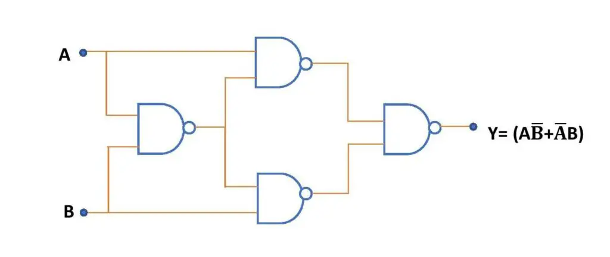
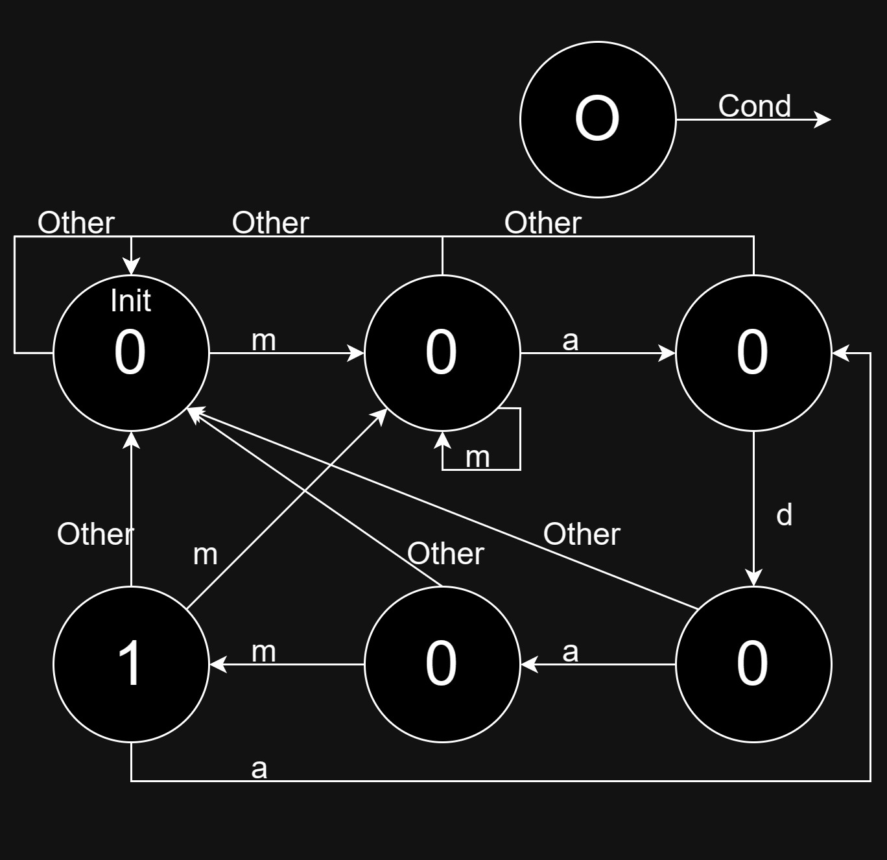

# Answer 2

## A1

首先从两个 $Y=1$ 的情况看出上半部分的图中 $A$ 和 $C$ 的位置，然后将 $C=0$ 对应的 $Y$ 填成 $1$，剩下的 $Y$ 填成 $0$，再由 $A=0,B=1,C=1,Y=0$ 得出图中下半部分的 $C$ 的位置，最后通过 $A=1,B=0,C=1,Y=0$ 得出图中下半部分的 $A$ 的位置。

|   A   |   B   |   C   |   Y   |
| :---: | :---: | :---: | :---: |
|   0   |   0   |   0   |   1   |
|   0   |   0   |   1   |   1   |
|   0   |   1   |   0   |   1   |
|   0   |   1   |   1   |   0   |
|   1   |   0   |   0   |   1   |
|   1   |   0   |   1   |   0   |
|   1   |   1   |   0   |   1   |
|   1   |   1   |   1   |   0   |

## A2

使用NAND可以得到如下三个基本的逻辑运算：

$$\rm NOT\ a\Leftrightarrow a\ NAND\ a$$
$$\rm a\ AND\ b\Leftrightarrow (a\ NAND\ b)\ NAND\ (a\ NAND\ b)$$
$$\rm a\ OR\ b\Leftrightarrow (a\ NAND\ a)\ NAND\ (b\ NAND\ b)$$

因此，NAND是逻辑完备的。

## A3

画出如下表格，其中 $A+B+C$ 的低位在 $S$，进位在 $C$，即可得到对应的图。

|   A   |   B   |   C   |   C   |   S   |
| :---: | :---: | :---: | :---: | :---: |
|   0   |   0   |   0   |   0   |   0   |
|   0   |   0   |   1   |   0   |   1   |
|   0   |   1   |   0   |   0   |   1   |
|   0   |   1   |   1   |   1   |   0   |
|   1   |   0   |   0   |   0   |   1   |
|   1   |   0   |   1   |   1   |   0   |
|   1   |   1   |   0   |   1   |   0   |
|   1   |   1   |   1   |   1   |   1   |

## A4

1. A(A[1:0]) 可以表示的最大值为 $3$
2. B(B[1:0]) 可以表示的最大值为 $3$
3. Y 的最大值为 $9$
4. 要表示 Y 的最大值需要 $4$ 位
5. 真值表如下

| A[1]  | A[0]  | B[1]  | B[0]  | Y[3]  | Y[2]  | Y[1]  | Y[0]  |
| :---: | :---: | :---: | :---: | :---: | :---: | :---: | :---: |
|   0   |   0   |   0   |   0   |   0   |   0   |   0   |   0   |
|   0   |   0   |   0   |   1   |   0   |   0   |   0   |   0   |
|   0   |   0   |   1   |   0   |   0   |   0   |   0   |   0   |
|   0   |   0   |   1   |   1   |   0   |   0   |   0   |   0   |
|   0   |   1   |   0   |   0   |   0   |   0   |   0   |   0   |
|   0   |   1   |   0   |   1   |   0   |   0   |   0   |   1   |
|   0   |   1   |   1   |   0   |   0   |   0   |   1   |   0   |
|   0   |   1   |   1   |   1   |   0   |   0   |   1   |   1   |
|   1   |   0   |   0   |   0   |   0   |   0   |   0   |   0   |
|   1   |   0   |   0   |   1   |   0   |   0   |   1   |   0   |
|   1   |   0   |   1   |   0   |   0   |   1   |   0   |   0   |
|   1   |   0   |   1   |   1   |   0   |   1   |   1   |   0   |
|   1   |   1   |   0   |   0   |   0   |   0   |   0   |   0   |
|   1   |   1   |   0   |   1   |   0   |   0   |   1   |   1   |
|   1   |   1   |   1   |   0   |   0   |   1   |   1   |   0   |
|   1   |   1   |   1   |   1   |   1   |   0   |   0   |   1   |

6. $Y[2]=(A[1]\ {\rm AND}\ ({\rm NOT}\ A[0])\ {\rm AND}\ B[1])\ \\{\rm OR}\ (A[1]\ {\rm AND}\ A[0]\ {\rm AND}\ B[1]\ {\rm AND}\ ({\rm NOT}\ B[0]))$

## A5

## A6

1. 

2. 6 states -> 3 bits -> 3 latches

## A7

1. $2^a$
2. $2^a\times b$

## A8

## A9

## A10
