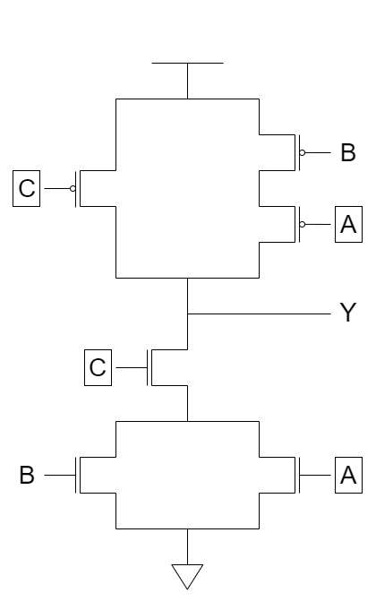
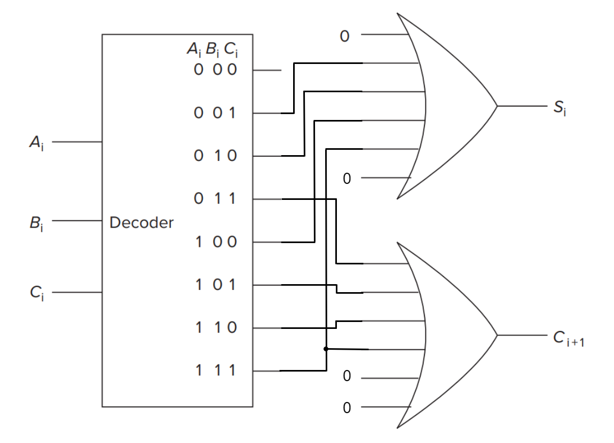
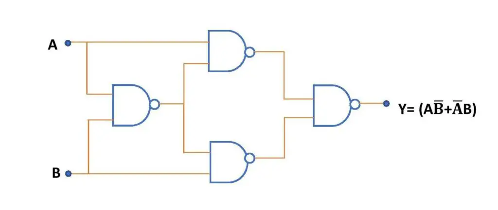
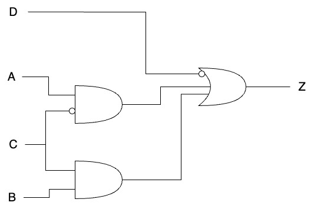
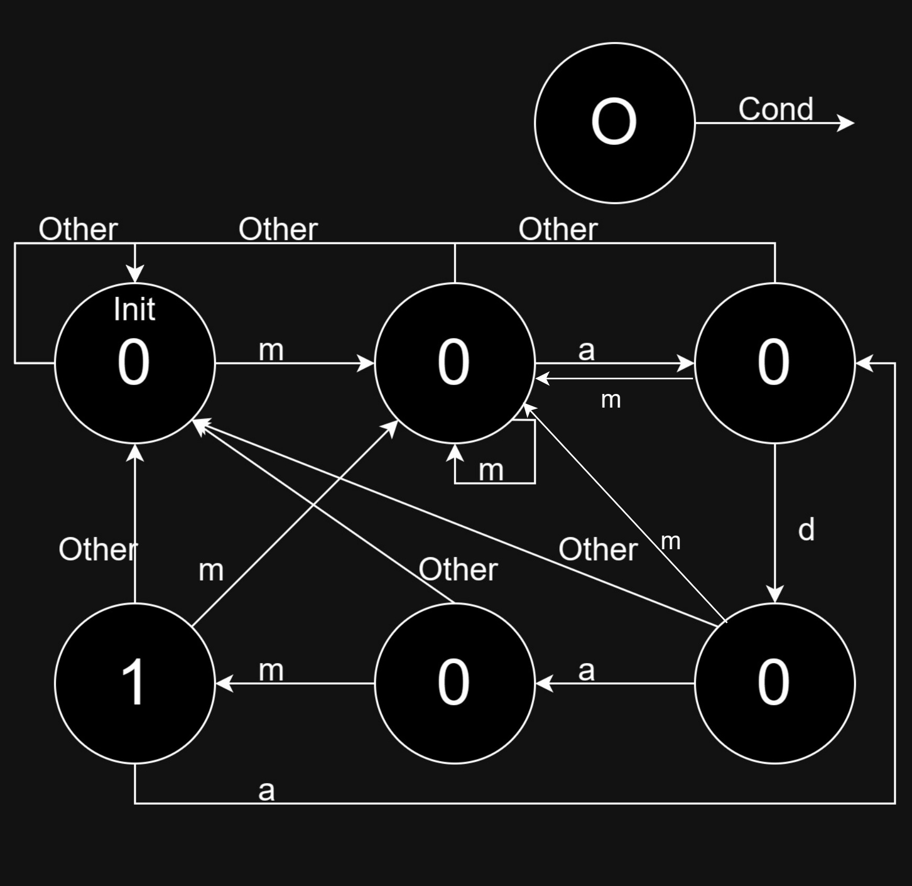

# Answer 2

## A1

首先从两个 $Y=1$ 的情况看出上半部分的图中 $A$ 和 $C$ 的位置，然后将 $C=0$ 对应的 $Y$ 填成 $1$，剩下的 $Y$ 填成 $0$，再由 $A=0,B=1,C=1,Y=0$ 得出图中下半部分的 $C$ 的位置，最后通过 $A=1,B=0,C=1,Y=0$ 得出图中下半部分的 $A$ 的位置。

|   A   |   B   |   C   |   Y   |
| :---: | :---: | :---: | :---: |
|   0   |   0   |   0   |   1   |
|   0   |   0   |   1   |   1   |
|   0   |   1   |   0   |   1   |
|   0   |   1   |   1   |   0   |
|   1   |   0   |   0   |   1   |
|   1   |   0   |   1   |   0   |
|   1   |   1   |   0   |   1   |
|   1   |   1   |   1   |   0   |

## A2

使用NAND可以得到如下三个基本的逻辑运算：

$$\rm NOT\ a\Leftrightarrow a\ NAND\ a$$
$$\rm a\ AND\ b\Leftrightarrow (a\ NAND\ b)\ NAND\ (a\ NAND\ b)$$
$$\rm a\ OR\ b\Leftrightarrow (a\ NAND\ a)\ NAND\ (b\ NAND\ b)$$

因此，NAND是逻辑完备的。

## A3

画出如下表格，其中 $A+B+C$ 的低位在 $S$，进位在 $C$，即可得到对应的图。

|   A   |   B   |   C   |   C   |   S   |
| :---: | :---: | :---: | :---: | :---: |
|   0   |   0   |   0   |   0   |   0   |
|   0   |   0   |   1   |   0   |   1   |
|   0   |   1   |   0   |   0   |   1   |
|   0   |   1   |   1   |   1   |   0   |
|   1   |   0   |   0   |   0   |   1   |
|   1   |   0   |   1   |   1   |   0   |
|   1   |   1   |   0   |   1   |   0   |
|   1   |   1   |   1   |   1   |   1   |

## A4

1. A(A[1:0]) 可以表示的最大值为 $3$
2. B(B[1:0]) 可以表示的最大值为 $3$
3. Y 的最大值为 $9$
4. 要表示 Y 的最大值需要 $4$ 位
5. 真值表如下

| A[1]  | A[0]  | B[1]  | B[0]  | Y[3]  | Y[2]  | Y[1]  | Y[0]  |
| :---: | :---: | :---: | :---: | :---: | :---: | :---: | :---: |
|   0   |   0   |   0   |   0   |   0   |   0   |   0   |   0   |
|   0   |   0   |   0   |   1   |   0   |   0   |   0   |   0   |
|   0   |   0   |   1   |   0   |   0   |   0   |   0   |   0   |
|   0   |   0   |   1   |   1   |   0   |   0   |   0   |   0   |
|   0   |   1   |   0   |   0   |   0   |   0   |   0   |   0   |
|   0   |   1   |   0   |   1   |   0   |   0   |   0   |   1   |
|   0   |   1   |   1   |   0   |   0   |   0   |   1   |   0   |
|   0   |   1   |   1   |   1   |   0   |   0   |   1   |   1   |
|   1   |   0   |   0   |   0   |   0   |   0   |   0   |   0   |
|   1   |   0   |   0   |   1   |   0   |   0   |   1   |   0   |
|   1   |   0   |   1   |   0   |   0   |   1   |   0   |   0   |
|   1   |   0   |   1   |   1   |   0   |   1   |   1   |   0   |
|   1   |   1   |   0   |   0   |   0   |   0   |   0   |   0   |
|   1   |   1   |   0   |   1   |   0   |   0   |   1   |   1   |
|   1   |   1   |   1   |   0   |   0   |   1   |   1   |   0   |
|   1   |   1   |   1   |   1   |   1   |   0   |   0   |   1   |

6. $Y[2]=(A[1]\ {\rm AND}\ ({\rm NOT}\ A[0])\ {\rm AND}\ B[1])\ \\{\rm OR}\ (A[1]\ {\rm AND}\ A[0]\ {\rm AND}\ B[1]\ {\rm AND}\ ({\rm NOT}\ B[0]))$

## A5

## A6

|   A   |   B   |   C   |   D   | POWEROFF |
| :---: | :---: | :---: | :---: | :------: |
|   0   |   0   |   0   |   0   |    0     |
|   0   |   0   |   0   |   1   |    0     |
|   0   |   0   |   1   |   0   |    0     |
|   0   |   0   |   1   |   1   |    0     |
|   0   |   1   |   0   |   0   |    x     |
|   0   |   1   |   0   |   1   |    0     |
|   0   |   1   |   1   |   0   |    1     |
|   0   |   1   |   1   |   1   |    0     |
|   1   |   0   |   0   |   0   |    1     |
|   1   |   0   |   0   |   1   |    0     |
|   1   |   0   |   1   |   0   |    0     |
|   1   |   0   |   1   |   1   |    0     |
|   1   |   1   |   0   |   0   |    x     |
|   1   |   1   |   0   |   1   |    x     |
|   1   |   1   |   1   |   0   |    x     |
|   1   |   1   |   1   |   1   |    x     |

## A7

1. 

2. 6 states -> 3 bits -> 3 latches

## A8

1. $2^a$
2. $2^a\times b$

## A9

1. 为了可以写入第一个位置，`A[1:0]`应当为00，同时为了写入`WE`应当为1

2. 为了将寻址能力提升到`k bit`，则需要将每个位置存储的bits提升为`k`位，对应则是在每个位置添加`k-3`个门控D锁存器。

3. 考虑能寻址至少257个地址的PC宽度为9位，为了使得内存的位置数量可以将PC的的寻址空间填满，则应当有总共512个内存位置，对应地址线应当增加至9条。由于在该问题中单个位置的bit数未发生改变，故寻址能力不变。

## A10

1. $\log_2(100 * 100 * 4 * 4 * 181 * 100^8) \approx 77.9384077848$ ，即最少使用78个bit存储

2. $$7 * 2\mathrm{bits}\\ 2 * 2\mathrm{bits}\\ 2\mathrm{bits\ for\ minutes}, 6\mathrm{bits\  for \ seconds}\\ 7 * 8\mathrm{bits}$$

总计 82 个 bit

3. 言之有理即可，第一种方法使用的bit数更少，但是第二种方法更加便于理解和维护。
