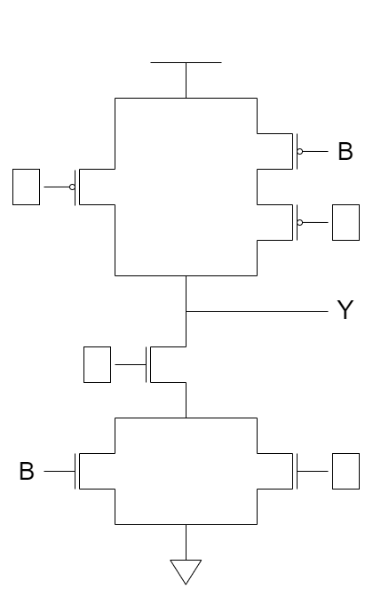

# Homework 2

## T1

Transistor circuit shown below produces the accompanying truth table. The inputs to some of the gates of the transistors are not specified. Also, the outputs for some of the input combinations of the truth table are not specified. Complete both specifications. i.e., all transistors will have their gates properly labeled with either A, B, or C, and all rows of the truth table will have a 0 or 1 specified as the output.

|   A   |   B   |   C   |   Y   |
| :---: | :---: | :---: | :---: |
|   0   |   0   |   0   |       |
|   0   |   0   |   1   |   1   |
|   0   |   1   |   0   |       |
|   0   |   1   |   1   |       |
|   1   |   0   |   0   |       |
|   1   |   0   |   1   |       |
|   1   |   1   |   0   |   1   |
|   1   |   1   |   1   |       |

## T2

## T3

## T4

## T5

## T6

## T7

## T8

## T9

## T10

