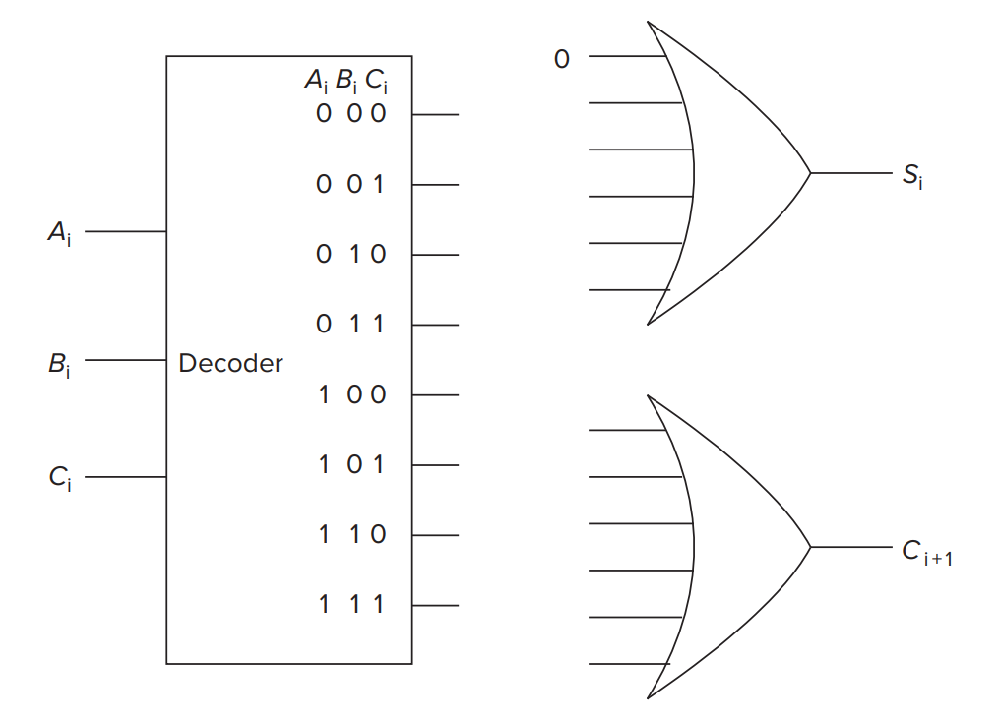
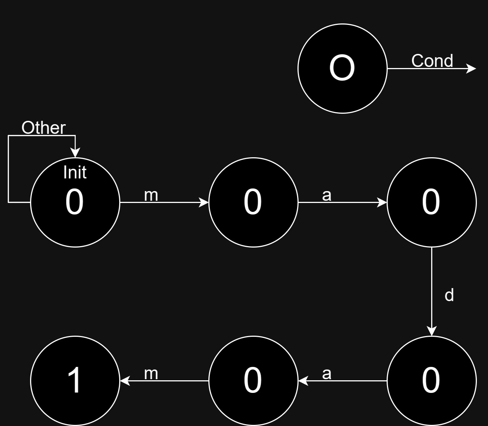

# Homework 2

## T1

Transistor circuit shown below produces the accompanying truth table. The inputs to some of the gates of the transistors are not specified. Also, the outputs for some of the input combinations of the truth table are not specified. Complete both specifications. i.e., all transistors will have their gates properly labeled with either A, B, or C, and all rows of the truth table will have a 0 or 1 specified as the output.

|   A   |   B   |   C   |   Y   |
| :---: | :---: | :---: | :---: |
|   0   |   0   |   0   |       |
|   0   |   0   |   1   |   1   |
|   0   |   1   |   0   |       |
|   0   |   1   |   1   |       |
|   1   |   0   |   0   |       |
|   1   |   0   |   1   |       |
|   1   |   1   |   0   |   1   |
|   1   |   1   |   1   |       |

## T2

Prove that NAND is logically complete.

## T3

Recall that the adder was built with individual **“slices”** that produced a sum bit and a carry-out bit based on the two operand bits A and B and the carry-in bit. We called such an element a full adder. Suppose we have a 3-to-8 decoder and two 6-input OR gates, as shown below. Can we connect them so that we have a full adder? If so, please do.

(Hint: If an input to an OR gate is not needed, we can simply put an input 0 on it and it will have no effect on anything. For example, see the following figure.)

## T4

Having designed a binary adder, you are now ready to design a 2-bit by 2-bit unsigned binary multiplier. The multiplier takes two 2-bit inputs A[1:0] and B[1:0] and produces an output Y, which is the product of A[1:0] and B[1:0]. The standard notation for this is:

$$Y = A10\cdot B10$$

1. What is the maximum value that can be represented in two bits for A(A[1:0])?
2. What is the maximum value that can be represented in two bits for B(B[1:0])?
3. What is the maximum possible value of Y?
4. What is the number of required bits to represent the maximum value of Y?
5. Write a truth table for the multiplier described above. You will have a four-input truth table with the inputs being A[1], A[0], B[1], and B[0].
6. Implement the third bit of output, Y[2] from the truth table using only AND, OR, and NOT gates. (You can just write the equation for Y[2] in terms of A[1], A[0], B[1], and B[0].)

## T5

晶体管 (CMOS)、N 进制、补码、位运算、浮点数、晶体管门、加法/减法器、锁存器、寄存器、内存、真值表、组合/时序逻辑、有限状态机

Design a **XOR** gate with NAND gates.

| $a$  | $b$  | $a\text{ XOR }b$ |
| ---- | ---- | ---------------- |
| 0    | 0    | 0                |
| 0    | 1    | 1                |
| 1    | 0    | 1                |
| 1    | 1    | 0                |

## T6

Here's an incomplete FSM that, when pattern `madam` occurs, produces an output `1`.

For example, given string `madamadam`, it'll produce `000010001`.

Your job is to:

1. **Complete** the state diagram.
2. Tell the **minimum number of latches** that are needed in order to implement this FSM.

> Hint: Why do we need latches in sequential logic?

## T7

Here's a memory that needs $a$ bit to represent its address, and its addressability is $b$ bit.

1. How much is the memory's **address space** at most?
2. How many bits can the memory store at most?

## T8

## T9

## T10

