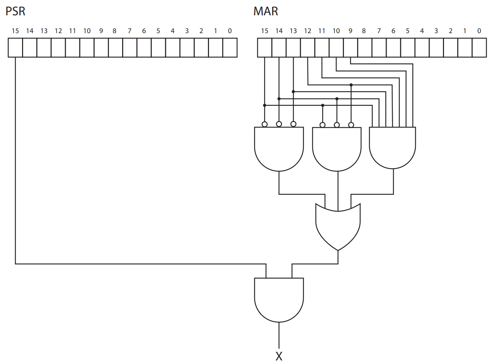

# Homework 6

## T1

Two students wrote interrupt service routines for an assignment. Both service routines did exactly the same work, but the first student accidentally used `RET` at the end of his routine, while the second student correctly used `RTI`. There are three errors that arose in the first student’s program due to his mistake. Describe any two of them.

## T2

After learning the instruction `JSR`, a student wrote the following program to print a character to the console.

```assembly
        .ORIG x3000
        JSR A
        OUT
        BRnzp DONE
A       AND R0, R0, #0
        ADD R0, R0, #9
        JSR B
        RET
DONE    HALT
ASCII   .FILL x0040
B       LD R1, ASCII
        ADD R0, R0, R1
        RET
        .END
```

1. What does the student intend to print?
2. Will the program print the character? Can you explain why?

## T3

The LC-3 contains the following logic.



Can you tell what signal `X` is? When will `X` be set to 1?

> Hint: You may refer to Figure C.2 in the textbook.

## T4

## T5

Here's a subroutine that takes 4 chars in hex from keyboard and store the value they represent in `R0` using polling technique. Note that it assumes all possible input characters are in `0123456789ABCDEF`. Some comments have been deleted.

```assembly
HEX_INPUT
    ST R1, SAVE_R1  ; R1 = Constant 1
    ST R2, SAVE_R2  ; R2 = Constant 2
    ST R3, SAVE_R3  ; R3 = Chars left (counter)
    ST R4, SAVE_R4  ; R4 = **DELETED**
    LD R1, C1
    LD R2, C2
    AND R3, R3, #0
    ADD R3, R3, #4
    AND R0, R0, #0  ; R0 stores our result
GETCHAR
    ; **DELETED**
    ADD R0, R0, R0
    ADD R0, R0, R0
    ADD R0, R0, R0
    ADD R0, R0, R0
WAIT
    LDI R4, KBSR    ; Check keyboard status
    BRzp ____       ; **DELETED**
    LDI R4, KBDR    ; Get KBDR
    ADD R4, R4, R1  ; Check if it is a letter
    BRzp ____       ; Got a capital letter
    ADD R4, R4, R2  ; Not a letter -> digit
    BR ____
LETTER
    ADD R4, R4, #10 ; **DELETED**
CONTINUE
    ADD R0, R0, R4  ; Add to result
    ADD R3, R3, #-1 ; Decr counter
    BRp ____        ; Wait for another char
    ; Restore regs
    LD R1, SAVE_R1
    LD R2, SAVE_R2
    LD R3, SAVE_R3
    LD R4, SAVE_R4
    RET
; Data
C1      .FILL #___  ; **DELETED**
C2      .FILL #___  ; **DELETED**
KBSR    .FILL xFE00
KBDR    .FILL xFE02
SAVE_R1 .BLKW 1
SAVE_R2 .BLKW 1
SAVE_R3 .BLKW 1
SAVE_R4 .BLKW 1
```

Your jobs:

1. Fill in the blanks (denoted by underlines `_`) to complete the program.
2. Briefly explain what the four consecutive `ADD R0, R0, R0` do.
3. We have no idea what `R0` stores before the subroutine is called, so we placed the instruction `AND R0, R0, #0` before the label `GETCHAR` in order to clear `R0`. Is this instruction necessary? Why or why not?

## T6

The following program needs to be assembled and stored in LC-3 memory:

```assembly
.ORIG x3000
    LEA R0, STRING
    PUTS
    LD R0, SYMBOL
    OUT
    HALT
STRING  .STRINGZ "H3ll0_W0r1d"
SYMBOL  .FILL #33
.END
```

1. What is the output of the program?
2. How many bytes of memory does the program occupy?

## T7

1. What problem might arise if a program does not check `KBSR` before *reading* `KBDR`?
2. What problem might arise if the keyboard does not check `KBSR` before *writing* to `KBDR`?
3. Which one of the two problems mentioned above is more likely to occur? Justify your answer.

## T8

## T9

## T10
